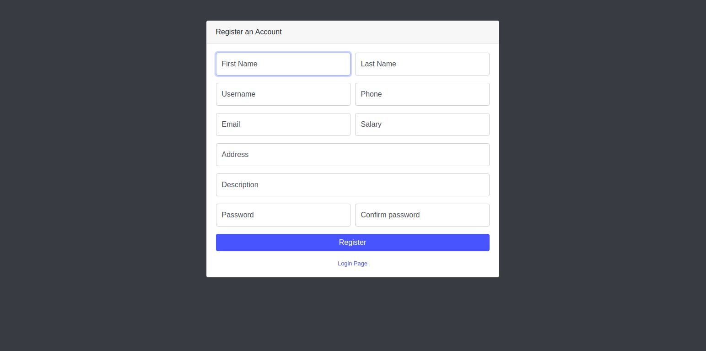

# WALLcontrol

Projekt zaliczeniowy kursu CodersLab.
Aplikacji typu CRM służąca do zarządzania ściankami wspinaczkowymi.

Funkcje: 
- logowania jako adminiostrator i pracownik. Administrator posiada dostęp do wszystkich funkcji, pracownik ma ograniczony dostęp, brak dostępu do wszystkich funkcji dla niezalogowanych użytkowników. 
- CRUD dla ścianek, pracowników, klientów, sekcji, biletów

Rozwój aplikacji: 
- stworzenie grafiku pracowników
- podliczanie pensji pracowników na podstawie biletów
- możliwość mailingu do pracowników i klientów

Homepage | Employees
------------ | -------------
 |  

Form 1 | Form 2
------------ | -------------
 |  

Search| Update
------------ | -------------
 |  